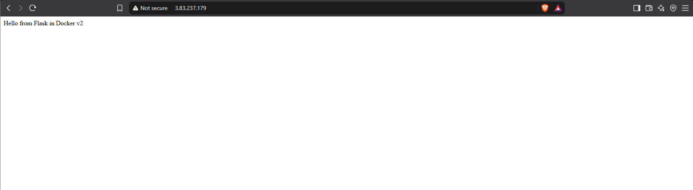
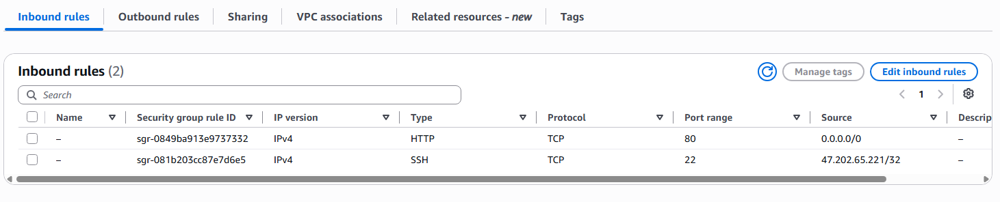

# AWS Flask Docker EC2

A Flask web app packaged in Docker and deployed by hand to an Amazon EC2 instance.

**Stack:** Python, Flask, gunicorn, Docker, Amazon Linux 2023, EC2 (us-east-1)
**Status:** Built, tested, and terminated. Evidence below.

## Architecture

```
Browser -> Internet -> Security group (80 open, 22 from my IP only)
        -> EC2 (Amazon Linux 2023)
        -> Docker: host port 80 -> container port 5000
        -> gunicorn -> Flask app
```

## Run it locally

```
docker build -t flask-app .
docker run -d --name flask-app -p 5000:5000 flask-app
curl http://localhost:5000          # greeting
curl http://localhost:5000/health   # {"status":"ok"}
```

## Deploy to EC2

1. Launch Amazon Linux 2023 with a security group allowing port 80 from anywhere and port 22 from your IP.
2. SSH in and install Docker and Git:

```
   sudo dnf install -y docker git
   sudo systemctl enable --now docker
   sudo usermod -aG docker ec2-user
```

3. Log out and back in, then build and run:

```
   git clone https://github.com/brandonlsosa-dev/aws-flask-docker-ec2.git
   cd aws-flask-docker-ec2
   docker build -t flask-app .
   docker run -d --name flask-app -p 80:5000 --restart unless-stopped flask-app
```

4. Open `http://PUBLIC-IP` in a browser.

## Evidence

[Command output](docs/run-output.txt)





## Key decisions

| Decision | Why |
|---|---|
| gunicorn, not Flask's built-in server | Flask's server is for development only |
| Install dependencies before copying code | Code edits reuse the cached dependency layer, so rebuilds take seconds |
| `.dockerignore` excludes `.git`, `.env`, `*.pem` | Anything in an image layer can be extracted by whoever pulls it |
| App binds to `0.0.0.0` | Docker forwards traffic to the container's network interface, not its loopback |
| SSH from my IP only, HTTP open | Only I need admin access, and the site is public |
| Clone over HTTPS, no SSH key on the server | A compromised server can't reach my GitHub account |

## Cost

- Instance: t3.micro, ran about 4 hours
- Bills for instance hours plus the public IPv4 address, about $0.015 per hour combined
- $10 monthly budget alert set before starting
- Terminated after testing, which also deleted the disk
- Total: PENDING

## What broke and what I learned

| Problem | Cause | Lesson |
|---|---|---|
| Container showed `Up` but curl got "connection reset" | App bound to `127.0.0.1` inside the container | When a healthy container is unreachable, check the bind address first |
| curl failed in 35 ms | Container stopped, nothing listening | Fast failure means the app or its port |
| curl hung for 5 seconds | Security group rule removed | Slow failure means a firewall or the network path |
| Bind test seemed to pass | Build was missing `.` so the image never rebuilt | Confirm a change took effect before trusting the result |
| Push rejected with GH007 | Commit carried my private email | Use the noreply address, and only amend unpushed commits |
| `RUNpip` typo reached GitHub | `sed` replacement dropped a space | Run `docker build` before every Dockerfile commit |
